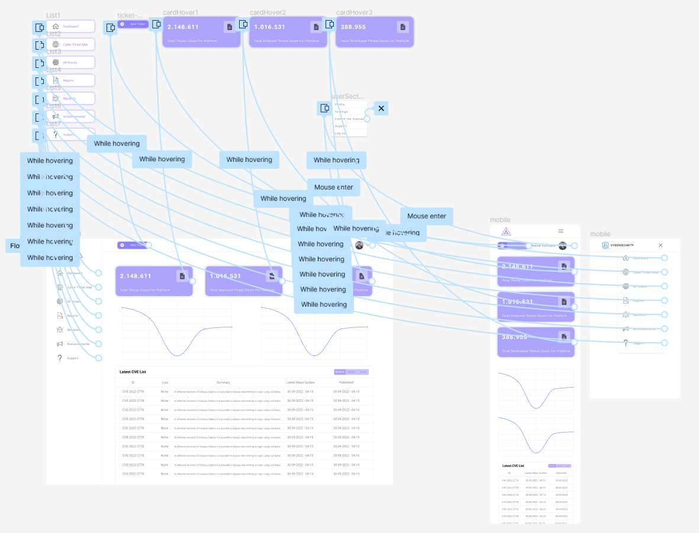
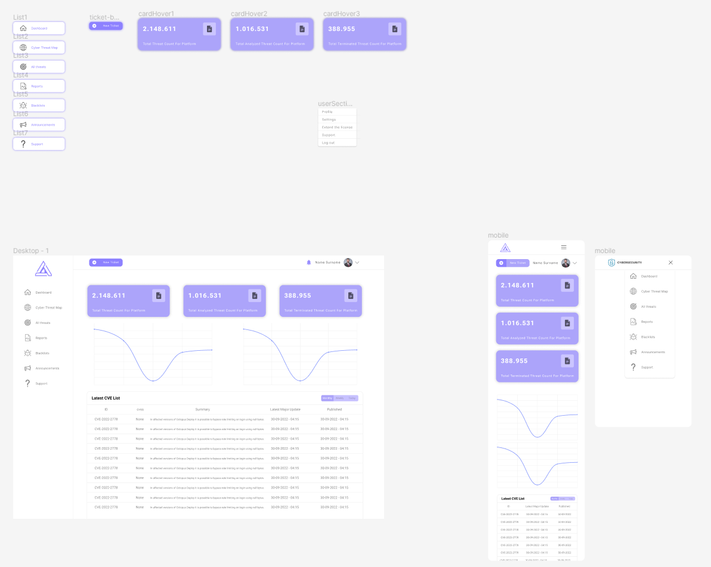
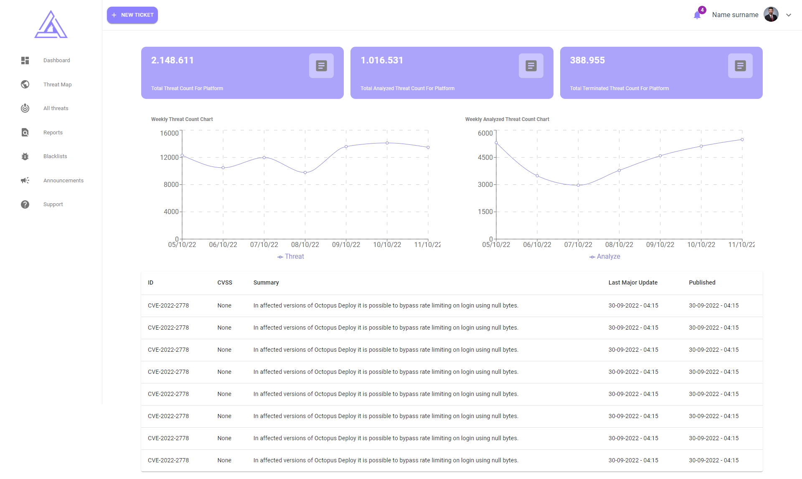
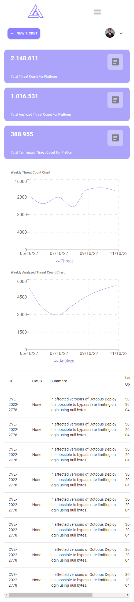

# Cyber Threat Intelligence Platform Dashboard

This project developed with **Agile methodology**. Designed in **Figma** and coded in **React**.
----
**Live**: https://remarkable-starburst-b4e472.netlify.app/
### Technologies
+ ReactJS
+ Material UI (MUI)
+ Recharts
+ Sass

## Screenshoots
### Design

### Deploy

